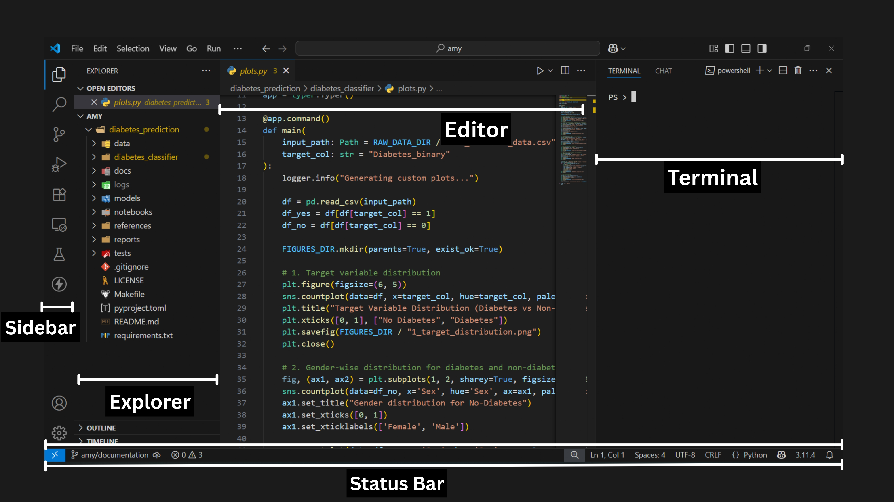

# Introduction to VSCode and Basic Terminal Commands

In this section, you'll get familiar with **Visual Studio Code (VSCode)** — a powerful code editor — and some essential **Linux/Unix terminal commands** that help you navigate and manage files.

---

## Getting Started with VSCode

### What is VSCode?

**Visual Studio Code** (VSCode) is a lightweight but powerful source code editor developed by Microsoft. It works on Windows, macOS, and Linux and supports many programming languages.

### Key Features:

- Smart code completion (IntelliSense)
- Built-in Git support
- Extensions and themes
- Integrated terminal
- Debugger

---

### Exploring the VSCode Interface

| Section        | Description                                                                 |
|----------------|-----------------------------------------------------------------------------|
| **Explorer**   | View, open, and manage your files and folders                               |
| **Editor**     | The main area where you edit your code                                      |
| **Sidebar**    | Switch between Explorer, Source Control, Extensions, etc.                   |
| **Terminal**   | Built-in terminal to run commands without leaving the editor                |
| **Status Bar** | Shows Git branch, Python interpreter, errors, and more                      |



---

## Using the Integrated Terminal

You can open the terminal in VSCode using:

- **Shortcut**: `Ctrl + `` ` (backtick)
- **Menu**: `Terminal > New Terminal`

This opens a shell (bash, PowerShell, or cmd) depending on your system.

---

## Basic Terminal Commands

These commands help you move around and manage files in your project.

### 1. `cd` – Change Directory

**Use:** Navigate between folders.

```bash
cd project_folder
cd ..         # Go one level up
cd ~          # Go to home directory
```

---

### 2. `ls` – List Files and Folders

**Use:** Show the contents of the current directory.

```bash
ls
ls -l        # Long format listing
ls -a        # Show hidden files
```

---

### 3. `mkdir` – Make Directory

**Use:** Create a new folder.

```bash
mkdir my_project
```

---

### 4. `rm` – Remove Files or Folders

**Use:** Delete files or directories.

```bash
rm filename.txt                # Remove a file
rm -r my_folder/               # Remove a folder and its contents (be careful!)
```
---

### 5. `touch` – Create an Empty File

**Use:** Quickly create a new file.

```bash
touch readme.md
```
> On Windows, `touch` may not work by default. Use `echo. > filename.txt` instead.

---

## Try It Yourself

```bash
mkdir demo_folder
cd demo_folder
touch index.html
ls
rm index.html
cd ..
rm -r demo_folder
```
---

## Summary

| Command | Description             |
| ------- | ----------------------- |
| `cd`    | Change directory        |
| `ls`    | List directory contents |
| `mkdir` | Create a new directory  |
| `rm`    | Remove files or folders |
| `touch` | Create an empty file    |

---

Now that you're familiar with VSCode and basic terminal commands, you're ready to start navigating your projects like a pro!

---


