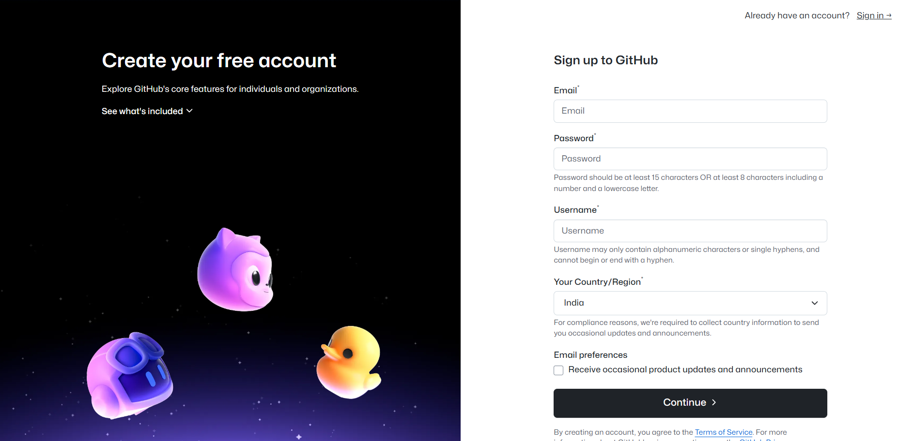
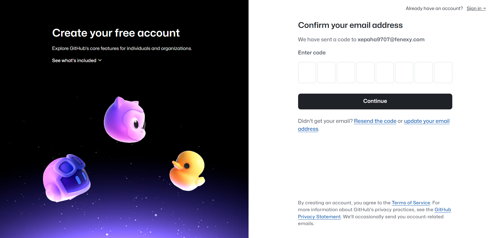
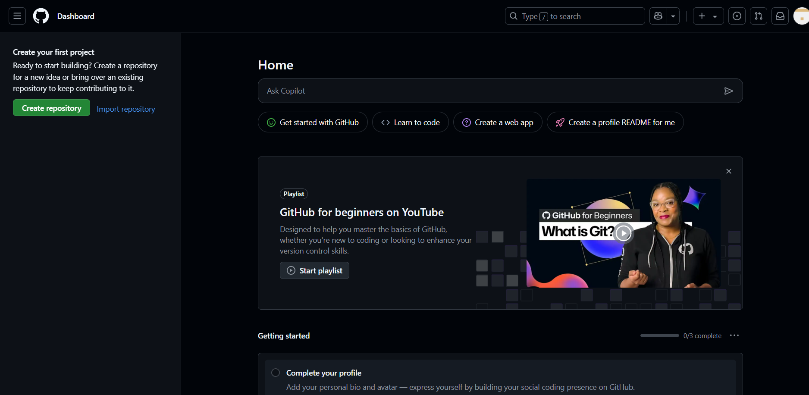

# Introduction to Git & GitHub

## Overview

Version control is essential in any collaborative software or data science project. This module introduces Git — the most popular version control system — and GitHub — a platform for hosting and managing Git repositories online.

By the end of this module, you'll understand:

- What version control is
- Why Git is important
- How to install and use Git
- The difference between Git and GitHub
- How to set up your GitHub account
- Basic Git operations for everyday work

---

## What is Version Control?

Version control allows multiple people to work on the same project while maintaining a complete history of changes. It helps with:

- Tracking progress
- Reverting to earlier versions
- Collaborating without overwriting each other's work

---

## What is Git?

Git is a **distributed version control system**. It keeps track of code changes, supports branching and merging, and allows collaboration between multiple developers. Git works locally on your machine but can sync with remote platforms like GitHub.

---

## What is GitHub?

GitHub is a **cloud platform that hosts Git repositories**. It adds collaborative features like:

- Remote storage of code
- Pull requests and code reviews
- Issue tracking
- CI/CD integrations

Git is the tool, GitHub is the platform where you use that tool collaboratively.

---

## Installing Git

Follow these steps to install Git:

### Windows

[Git download Link](https://git-scm.com/download/win)
```
1. Download Git from https://git-scm.com/download/win
2. Run the installer and follow the default options
3. Open "Git Bash" from the Start menu
```
Git official download page:


### macOS

In Terminal:

```bash
brew install git
```

### Linux

In Terminal:

```bash
sudo apt update
sudo apt install git
```
### Verify Installation

Open your terminal and run:

```bash
git --version
```

Expected output:

```bash
git version 2.xx.x
```

You have successfully installed git!

---

## Create a GitHub Account

1. Go to [GitHub official site](https://github.com)

    


2. Click Sign up - Top Right corner 


3. Fill the details

    

4. Verify your email

    

After successfull account creation you will land on the GitHub Home page.



Congratulations — you’re now on GitHub!

---

## Configure Git for Your Identity

After installation, configure Git with your identity, this info will appear in every commit you make.

Open a terminal and run:

```bash
git config --global user.name "Your Name"
git config --global user.email "you@example.com"
```

To verify setup:

```bash
git config --list
```
---

## Lets Create a New Project

Let’s start a simple project.

Navigate to the folder where you want your new project to be and open terminal.

Do the following in the terminal:

```bash
mkdir my-first-ds-project    #create a new-folder
cd my-first-ds-project       #navigate to the folder
```

Create a couple of files:

```bash
echo "# My First Data Science Project" > README.md
echo 'print("Hello, Data Science")' > hello.py
```

Turn your folder into a Git repository:

```bash
git init
```

Track your files and commit:

```bash
git add .
git commit -m "Initial commit: add README and hello.py"
```

## Let's push your work to GitHub:

Create a Repository on GitHub:

1. Log into GitHub
2. Click the `New` icon (green button on left panel) → New repository
3. Set:
- Repository name: my-first-ds-project
- Visibility: public or private
4. Click Create repository

Keep this page open — it will show you push instructions.

Before pushing, we need to configure the Authentication, there are 2 ways to achieve this: 

### Option 1. Authenticate Using Personal Access Token (HTTPS)

Generate Token:

1. Go to: https://github.com/settings/tokens
2. Click Tokens(Classic) → Generate new token → Generate New Token (Classic)  
3. Set:
    - Note: e.g., git-token-for-demo
    - Expiry: 90 days or more
    - Repo access: Full control of private repositories
4. Generate and copy the token securely

Connect Remote (HTTPS):

```bash
git remote add origin https://github.com/your-username/my-first-ds-project.git
git branch -M main
git push origin main
```
When prompted:

- Username → GitHub username
- Password → Paste your PAT (Personal Access Token) Generated.

You’re done!

### Option 2. Authenticate Using SSH Key (Preferred for Long-Term Use)

### Step A: Generate SSH Key:

In terminal:

Bash: 
```bash
ssh-keygen -t ed25519 -C "your@email.com" -f ~/.ssh/id_ed25519_new_account
```

Windows:
```shell
ssh-keygen -t ed25519 -C "ricky-example@outlook.com" -f "$env:USERPROFILE\.ssh\id_ed25519_new_account"
```

> Press Enter to accept default file location
> You may set a passphrase or leave it blank

Add your new private key to the SSH agent:

Bash:
```bash
ssh-add ~/.ssh/id_ed25519_new_account
```

Windows:
```shell
Start-Service ssh-agent
ssh-add "$env:USERPROFILE\.ssh\id_ed25519_new_account"
```

### Configure Your Local Git for Multiple Accounts (Optional but Recommended, when working with multiple GitHub accounts)

Open or create the SSH config file:

Bash:
```bash
nano ~/.ssh/config
# Or use your preferred text editor (e.g., code ~/.ssh/config for VS Code)
```
Windows:
```shell
notepad "$env:USERPROFILE\.ssh\config"
```

Add entries for each GitHub account. Here's an example:

```
# Personal GitHub account
Host github.com-personal
    HostName github.com
    User git
    IdentityFile ~/.ssh/id_ed25519 # Or ~/.ssh/id_rsa if that's your default personal key
    IdentitiesOnly yes

# Work GitHub account
Host github.com-work
    HostName github.com
    User git
    IdentityFile ~/.ssh/id_ed25519_new_account # Path to your newly generated private key
    IdentitiesOnly yes
```

`Host`: This is an alias you'll use in your Git clone URLs. It's arbitrary but should be descriptive (e.g., github.com-personal, github.com-work).

`HostName github.com`: This always points to the actual GitHub domain.

`User git`: This is the standard SSH user for GitHub.

`IdentityFile`: This specifies the private key file to use for this particular host alias. Make sure the path is correct.

`IdentitiesOnly yes`: This tells SSH to only use the specified IdentityFile for this host, preventing it from trying other keys and potentially causing authentication issues.

### Step B: Add SSH Key to GitHub:

1. Copy your public key:

Bash:
```bash
cat ~/.ssh/id_ed25519_new_account.pub
```

Windows:
```shell
Get-Content "$env:USERPROFILE\.ssh\id_ed25519_new_account.pub"
```

2. Go to GitHub → Settings → SSH and GPG Keys
3. Click New SSH Key
    - Title: e.g., “Laptop Key”
4. Paste your key into the box
5. Save

### Step C: Test SSH Connection:

```bash
ssh -T git@github.com-work
```

You should see:

```bash
Hi your-username! You've successfully authenticated.
```

### Step D: Link Your Repo with SSH:

Instead of HTTPS, use:

```bash
git remote add origin git@github.com-work:your-username/my-first-ds-project.git
```

Then push:

```bash
git branch -M main
git push -u origin main
```

No password or token required!

---

## Verifying Your Push on GitHub

Go to Your GitHub Repository Page: 

1. Visit: https://github.com
2. In the top-right, click your profile picture → **Your repositories**
3. Click the repo you created, e.g., `my-first-ds-project`

You should now see:
- A list of your files (e.g., `README.md`, `app.py`)
- A commit message like:  
  `Initial commit: add README and hello.py`
- A branch name `main`


Congratulations! Now you know how to get started with Git and How to push your work to GitHub.

---


## Git & GitHub Basic Terminologies

| **Term**              | **Definition**                                                                 |
| --------------------- | ------------------------------------------------------------------------------ |
| **Git**               | A distributed version control system used to track changes in source code.     |
| **GitHub**            | A web-based platform for hosting Git repositories with collaboration features. |
| **Repository (Repo)** | A directory that contains all your project files and Git version history.      |
| **Clone**             | A copy of a repository stored locally on your computer.                        |
| **Fork**              | A personal copy of someone else’s GitHub repository.                           |
| **Commit**            | A snapshot of changes made to the files in the repo; like saving a version.    |
| **Push**              | Upload your committed changes from local to the GitHub repository.             |
| **Pull**              | Fetch and integrate changes from a remote repository to your local machine.    |
| **Branch**            | A separate line of development; allows working on features independently.      |
| **Merge**             | Combines changes from one branch into another (usually `feature` → `main`).    |
| **Main / Master**     | The default primary branch of a Git repository.                                |
| **Staging Area**      | Where changes are placed before committing; acts as a preparation zone.        |
| **HEAD**              | A pointer that represents the current checked-out commit/branch.               |
| **Remote**            | A version of the repo hosted on a server (e.g., GitHub).                       |
| **Origin**            | The default name for the remote repository when you clone it.                  |
| **Pull Request (PR)** | A request to merge code from one branch/repo into another, usually for review. |
| **Conflict**          | When Git can't automatically merge changes; manual resolution is required.     |
| **.gitignore**        | A file listing files/folders Git should ignore (e.g., `venv/`, `*.log`).       |
| **SHA / Hash**        | A unique identifier (40-character) for each commit.                            |
| **Diff**              | A comparison showing what’s changed between two commits or files.              |
| **Log**               | A history of commits made to the repo.                                         |
| **Tag**               | A marker pointing to a specific commit, often used for versioning.             |

---

## Basic Git Workflow

Here’s a simple flow you’ll use regularly:

```bash
# Clone a repository
git clone https://github.com/username/repo-name.git

# Navigate into the folder
cd repo-name

# Create a new file or make changes
touch new_file.py

# Check status
git status

# Stage changes
git add new_file.py

# Commit changes
git commit -m "Add new_file.py"

# Push to GitHub
git push origin main
```
---


## Common Git Commands

| Command                    | Purpose                         |
| -------------------------- | ------------------------------- |
| **`git init`**                | Initialize a new Git repo       |
| **`git clone <url>`**          | Clone a remote repo             |
| **`git status`**               | Show file changes               |
| **`git add <file>`**           | Stage changes                   |
| **`git commit -m "msg"`**      | Save changes                    |
| **`git push`**                 | Push to remote repo             |
| **`git pull`**                 | Get latest changes              |
| **`git log`**                 | Show commit history             |
| **`git branch`**               | View branches                   |
| **`git checkout -b <branch>`** | Create and switch to new branch |

## Git vs GitHub: Key Differences

| Git                          | GitHub                   |
| ---------------------------- | ------------------------ |
| Local version control system | Cloud-based platform     |
| Command-line based           | Web and GUI interface    |
| Works offline                | Requires internet        |
| Manages source history       | Adds collaboration tools |

---


## Summary

In this module, you:

- Installed and configured Git
- Created a GitHub account
- Learned basic Git commands
- Understood the GitHub workflow