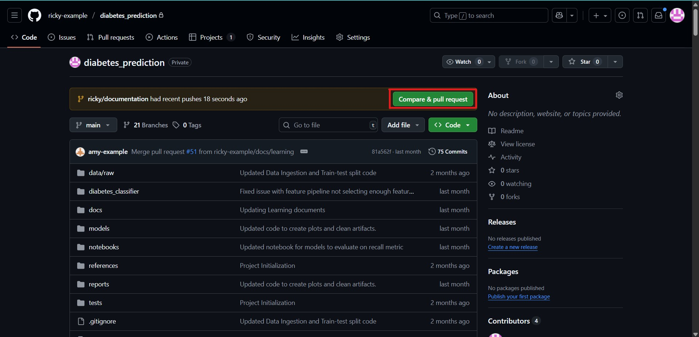
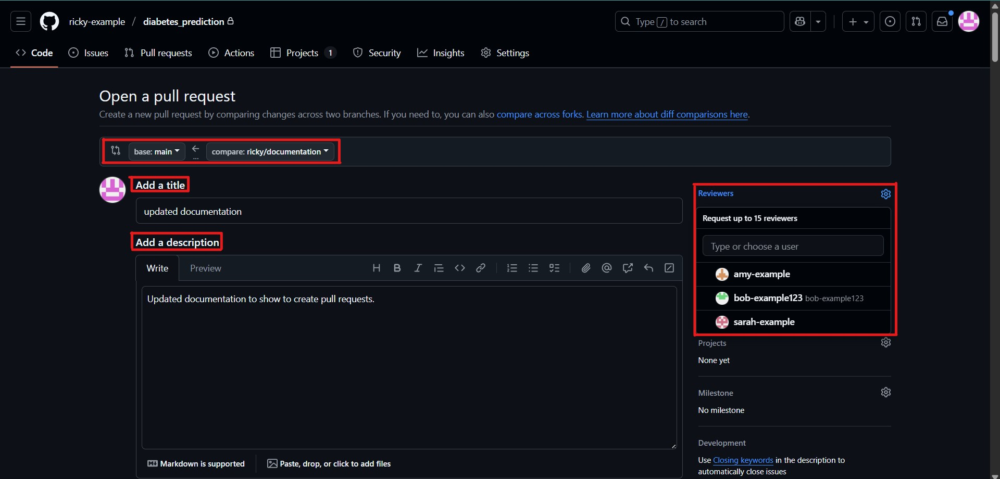
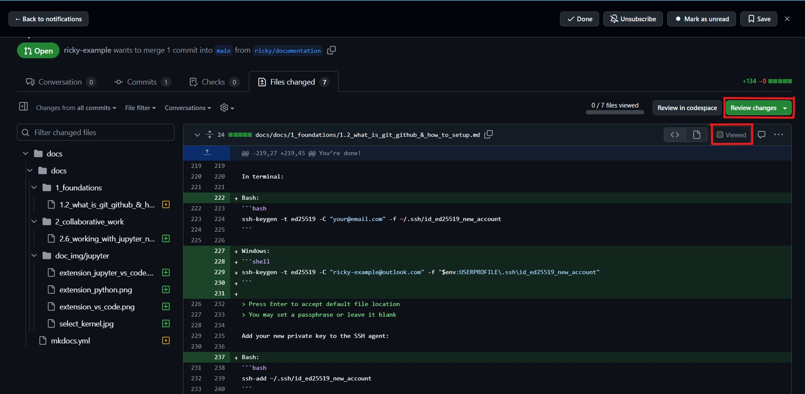
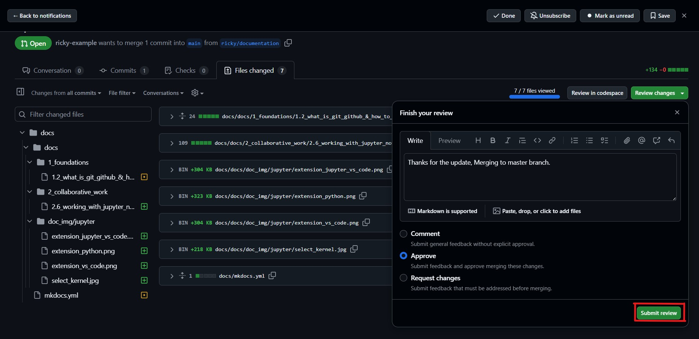
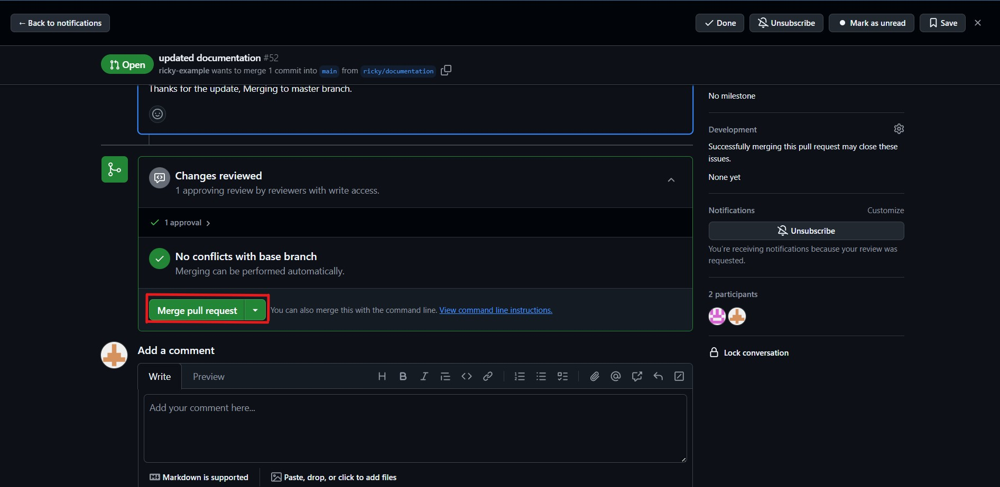

# Pull Requests – Review, Approve, Merge

---

## What Is a Pull Request (PR)?

A **Pull Request (PR)** is how you propose changes you've made on a **branch** to be merged into another branch (usually `main` or `dev`).  
It’s a key part of **team collaboration** in GitHub.

PRs let your team:

- Review each other’s code
- Catch bugs before merging
- Discuss improvements
- Enforce best practices

> Think of it as saying: “Hey team, I’ve made changes. Can someone review and approve them before they go live?”

---

## Basic PR Workflow

1. **Create a branch** (e.g., `feature/add-plot`)
2. **Make changes**
3. **Commit & push** the branch to GitHub
4. **Open a pull request**
5. **Assign reviewers**
6. **Review and discuss**
7. **Merge when approved**

---

## Step-by-Step: Making a PR

### 1️. Create and push a branch

```bash
git checkout -b feature/hello-pr
# make changes, e.g., edit app.py
git add .
git commit -m "Add feature from hello-pr branch"
git push origin feature/hello-pr
```
---

### 2. Open a Pull Request on GitHub

1. Go to your repo on GitHub
2. Click Compare & pull request
3. Set:
    - Base branch: `main` or `dev`
    - Compare branch: `feature/hello-pr`
4. Add a clear title and description
5. Click Create pull request

    

---

### 3. Assign Reviewers

Use the Reviewers panel to request feedback from teammates

You can also assign labels like:
    `bug`
    `enhancement`
    `needs testing`



---

### 4. Review Process

Reviewers can:

- View a file-by-file diff
- Add comments
- Approve or request changes
- Use suggested code edits



Team best practices:

- Review for correctness
- Check for clarity and style
- Ensure no conflicts with other work
- Test changes if needed




---

### 5. Merge the Pull Request

Once reviewed and approved:

 - Click Merge pull request
 - Confirm the merge
 - (Optional) Delete the branch from GitHub


> This keeps your repo clean and avoids stale branches.



---

### 6. Sync the Merged Code Locally **(Important)**

If someone else merged a PR, pull the latest main branch:

```bash
git checkout main
git pull origin main
```

This will ensure your local work is up to date with main branch and avoid any merge conflicts. Do the above frequently or always before starting to work.

---


## Why Use PRs Instead of Pushing to Main?

| Direct Push                | Pull Request               |
| -------------------------- | -------------------------- |
| No review process          | Encourages code review     |
| Can break the codebase     | Adds quality control       |
| No history of discussion   | Tracks every change        |
| Mistakes go live instantly | Safe, peer-checked merging |

---

## Summary

- Pull Requests help teams safely review and merge code
- Each PR compares one branch into another
- PRs allow discussion, feedback, and better quality control
- GitHub tracks the full history and comments for every PR

