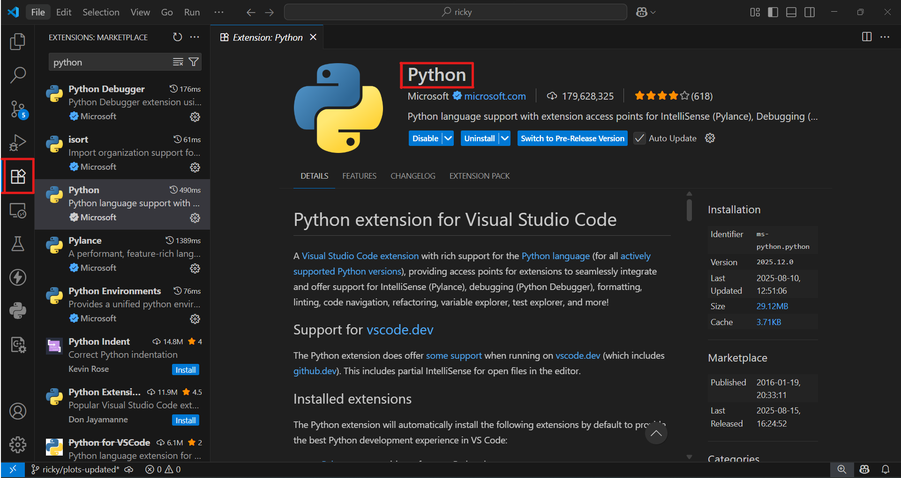
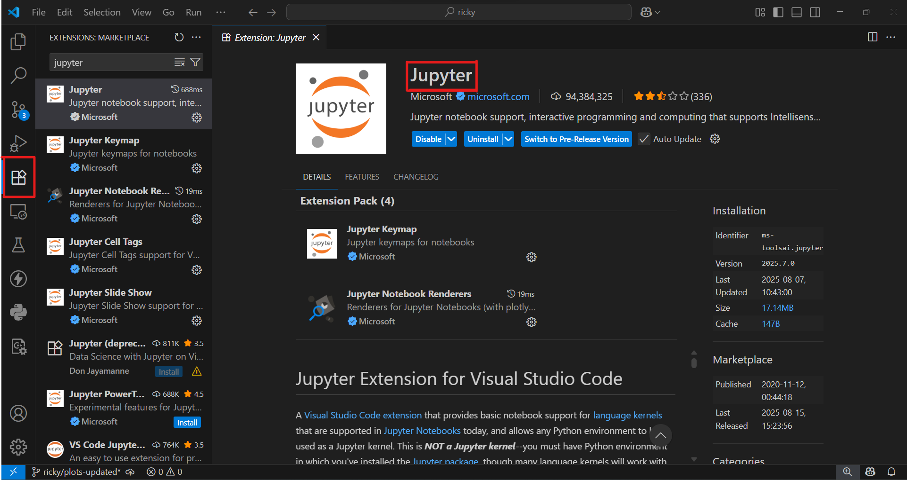
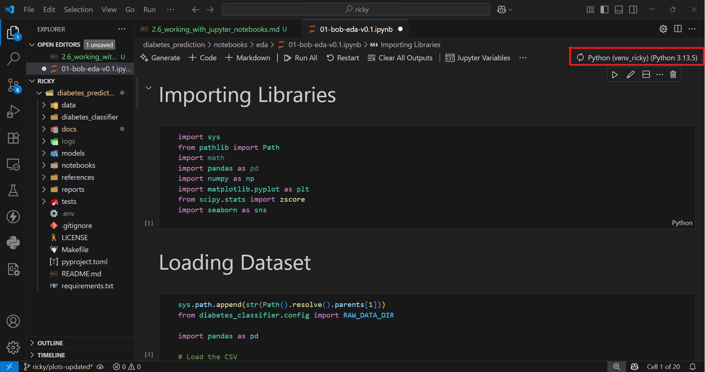

# Installing and Using Jupyter Notebooks in VS Code

Jupyter Notebooks are an essential tool for data science and Python projects. They allow you to mix **code, text, and visualizations** in one interactive document. With VS Code, you can run and manage notebooks seamlessly inside your editor.

---

## Installing Jupyter Support in VS Code

### What you need
- **Python** installed on your system (3.8 or higher recommended)
- **VS Code** installed
- Required extensions for Jupyter

### Steps to install

 1. **Install the Python extension**  
    - Open VS Code  
    - Go to Extensions (`Ctrl+Shift+X` or the square icon on the left bar)  
    - Search for **Python** and install the official Microsoft extension  

   

 2. **Install the Jupyter extension**  
    - In the Extensions panel, search for **Jupyter**  
    - Install the official extension by Microsoft  

   

 3. **Install Jupyter in your Python environment**  
    Run this in your terminal (inside your virtual environment if you are using one):  

    ```bash
    pip install notebook jupyterlab
        ```
---

## Creating and Running a Jupyter Notebook in VS Code

### How to create a new notebook

1. Open VS Code
2. Press `Ctrl+Shift+P` to open the Command Palette
3. Search for “Jupyter: Create New Blank Notebook”
4. Save it with a `.ipynb` extension

### How to run a cell

 - Type Python code into a cell (e.g., `print("Hello, Jupyter in VS Code!")`)
- Press Shift+Enter to run the current cell
- Output will appear directly below the cell

---

## Managing Kernels in VS Code
### What it does

A kernel is the Python environment where your notebook code runs. VS Code lets you switch between kernels (e.g., virtual environments, conda environments, system Python).

### How to select kernel

- Click the kernel name in the top-right corner of your notebook
- Choose the environment you want to use (for example, venv, conda, or system Python)

   

### Why use it

- Ensures your notebook uses the correct dependencies
- Keeps projects isolated when using multiple environments

---

## Exporting Virtual Environments as Kernel

To export your current virtual environment as kernel to use in the notebooks, Run this command in your terminal.

You can change the `--name` and `--display-name` to your choice.

```shell
python -m ipykernel install --user --name=venv_name --display-name "Python (venv_name)"
```

---

## Installing Packages Inside Notebooks

If you need to install a package while working inside a notebook, you can run:

```shell
!pip install pandas matplotlib scikit-learn
```

Tip: It’s better to install packages in your environment before running notebooks, but this command can be handy for quick tests.

---

Summary Table:

| Step                      | Purpose                                        |
| ------------------------- | ---------------------------------------------- |
| Install Python ext.       | Adds Python support to VS Code                 |
| Install Jupyter ext.      | Enables notebook functionality                 |
| `pip install notebook`    | Installs Jupyter package in Python environment |
| Create `.ipynb` file      | Start a new Jupyter Notebook                   |
| Run cells (`Shift+Enter`) | Execute code interactively                     |
| Select kernel             | Choose which Python environment to run code    |


---