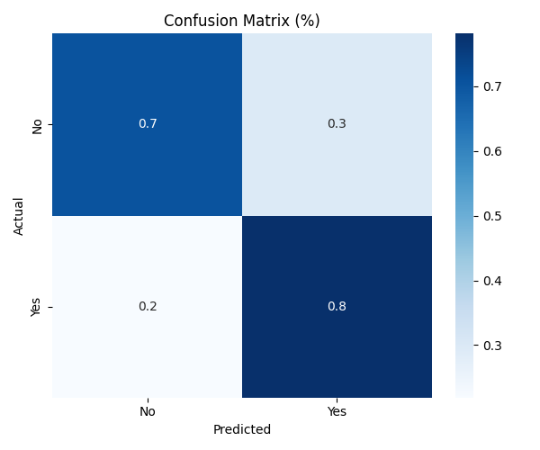

# Model Test Evaluation

## Classification Report

```
              precision    recall  f1-score   support

         0.0       0.76      0.71      0.73      7010
         1.0       0.73      0.78      0.75      7034

    accuracy                           0.74     14044
   macro avg       0.74      0.74      0.74     14044
weighted avg       0.74      0.74      0.74     14044

```

**Accuracy**: `0.7431`

**Recall**: `0.7809`

**Precision**: `0.7266`

## Confusion Matrix (Percentage)


